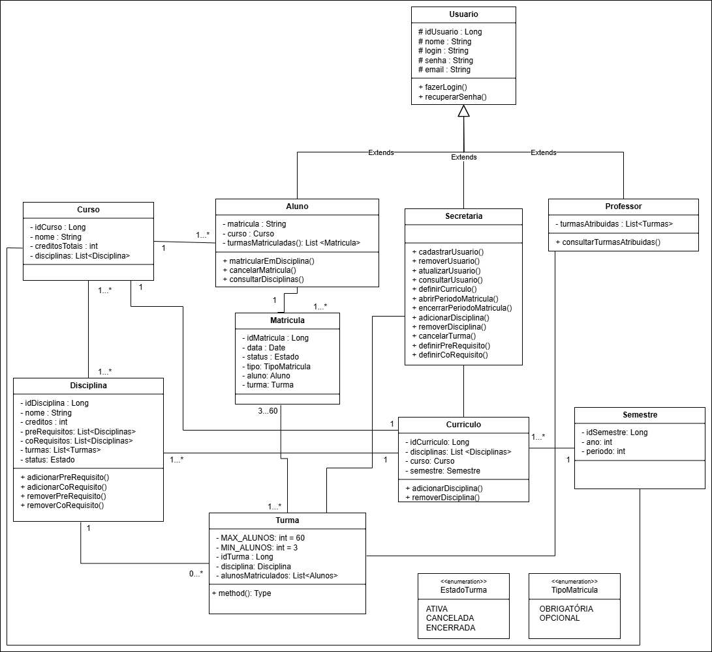

# <p align="center">Enrollify - Sistema de Matrículas Universitário</p>

<p align="center">
  
</p>

O Enrollify, Sistema de Matrículas Universitárias é uma aplicação web desenvolvida para informatizar e otimizar o processo de matrícula em uma universidade. O sistema permite que a secretaria acadêmica gerencie o currículo semestral, mantendo informações sobre cursos, disciplinas, professores e alunos.

## Integrantes

* [Amanda Bueno Campos Peixoto](https://github.com/abc-peixoto)
* [Gabriel Lucas Tinoco de Aguiar](https://github.com/gabrieltinoco)
* [Gustavo Pimentel Carvalho Costa](https://github.com/gustavo-p0)

## Orientadores
* [João Pedro Oliveira Batisteli](https://github.com/JPBatisteli)

## Histórias de Usuário

### Consultar Turmas Atribuídas
 Como professor,
 quero consultar as turmas que me foram atribuídas no semestre,
 para acompanhar em quais disciplinas estou responsável e poder gerenciar meus alunos.

### Definir disciplina pré-requisito
 Como funcionário da secretaria,
 quero definir uma disciplina como pré-requisito de outra,
 para assegurar que os alunos possuam o conhecimento necessário antes de cursar disciplinas mais avançadas.

### Definir disciplina co-requisito
 Como funcionário da secretaria,
 quero definir uma disciplina como co-requisito de outra,
 para garantir que os alunos se matriculem em disciplinas que precisam ser cursadas simultaneamente.
 
### Cadastrar usuário
 Como funcionário da secretaria,
 quero cadastrar novos usuários no sistema,
 para que eles possam ter acesso e utilizar suas funcionalidades de acordo com seus perfis.

### Remover usuário
 Como funcionário da secretaria,
 quero remover o cadastro de um usuário,
 para manter a base de dados do sistema atualizada com usuários ativos.

### Atualizar usuário
 Como funcionário da secretaria,
 quero atualizar as informações cadastrais de um usuário,
 para garantir que os dados de alunos e professores estejam sempre corretos e atualizados.

### Consultar usuário
 Como funcionário da secretaria,
 quero consultar as informações de um usuário específico,
 para poder verificar dados cadastrais, histórico e situação atual no sistema.

### Definir currículo
 Como funcionário da secretaria,
 quero definir o currículo de um semestre para cada curso,
 para que os alunos saibam quais disciplinas estão disponíveis para matrícula.

### Abrir período de matrícula
 Como funcionário da secretaria,
 quero abrir o período de matrículas,
 para permitir que os alunos possam acessar o sistema e se inscrever nas disciplinas do próximo semestre.

### Encerrar período de matrícula
 Como funcionário da secretaria,
 quero encerrar o período de matrículas,
 para consolidar as turmas, cancelar as disciplinas que não atingiram o número mínimo de alunos e processar as matrículas finalizadas.

### Adicionar disciplina
 Como funcionário da secretaria,
 quero adicionar novas disciplinas ao catálogo da universidade,
 para expandir a oferta de matérias disponíveis para os cursos.

### Remover disciplina
 Como funcionário da secretaria,
 quero remover uma disciplina do catálogo,
 para descontinuar matérias que não serão mais ofertadas pela universidade.

### Matricular em disciplina
 Como aluno,
 quero me matricular em disciplinas durante o período de matrículas,
 para poder cursar as matérias do próximo semestre e avançar no meu curso.

### Matricular em disciplina obrigatória
 Como aluno,
 quero me matricular em até 4 disciplinas definidas como obrigatórias,
 para cumprir os requisitos curriculares essenciais do meu curso.

### Matricular em disciplina optativa
 Como aluno,
 quero me matricular em até 2 disciplinas optativas,
 para complementar minha formação acadêmica e atender aos créditos necessários.
 
### Login no sistema
 Como usuário,
 quero acessar o sistema com meu login e senha,
 para visualizar e gerenciar minhas informações de acordo com meu perfil.
 
### Recuperar senha
 Como usuário,
 quero solicitar a recuperação da minha senha caso a tenha esquecido,
 para poder voltar a acessar o sistema de forma segura.

### Notificar Sistema de Cobranças
 Como Sistema de Matrículas, 
 quero enviar os dados de uma matrícula confirmada, 
 para que o Sistema de Cobranças possa gerar a fatura para o aluno.

## Diagrama de casos de uso

<p align="center">
  
</p>

## Diagrama de Classes

<p align="center">
  
</p>

## Instruções de utilização

### Pré-requisitos

- Java JDK 17 ou superior instalado no ambiente (em dev containers, já está disponível).
- Terminal Linux (Ubuntu 24.04.2 LTS).

### Compilação

Abra o terminal na raiz do projeto e execute:

```bash
cd implementacao/Enrollify/src
javac *.java
```

Isso irá compilar todos os arquivos `.java` presentes na pasta `src`.

### Execução

Após a compilação, execute o programa principal:

```bash
java main
```

> O arquivo `main.java` contém o método `public static void main(String[] args)` para iniciar o sistema.

### Execução de Testes

Atualmente, não há testes automatizados implementados no diretório.

---

Caso queira abrir a documentação ou diagramas, utilize:

```bash
$BROWSER projeto/diagramas/imagens/use-case-diagram.png
$BROWSER projeto/diagramas/imagens/diagrama.png
```
